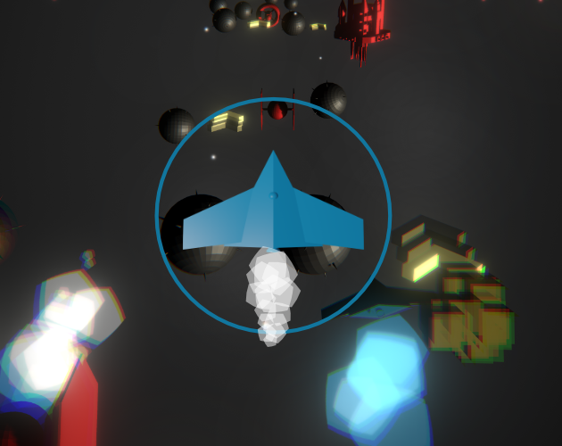

# Star Squadron

Casual game for [iOS](https://itunes.apple.com/us/app/star-squadron/id1557129644?mt=8&uo=4) and [Android](https://play.google.com/store/apps/details?id=io.pixelook.squadron) mobile phones.    
WebGL version is released on the [https://pixelook.itch.io/star-squadron](https://pixelook.itch.io/star-squadron) page.

## Videos

[Youtube: Star Squadron - Gameplay #4](https://youtu.be/64V2tVjZ5BQ)  
[Youtube: Star Squadron - Making of game #1](https://youtu.be/xek2RuB8MXA)  
[Youtube: Star Squadron - Making of game prototype #3](https://youtu.be/h6CgZTHu7pw)  
[Youtube: Star Squadron - Making of game prototype #2](https://youtu.be/59keyLS9A-E)  
[Youtube: Star Squadron - Making of game prototype #1](https://youtu.be/nLrQCHiJSm4)  

## Used tools
[Affinity Designer](https://affinity.serif.com/en-gb/designer/) - for drawing  
[Bfxr](http://bfxr.net/), [ocenaudio](https://www.ocenaudio.com) - for SFX and sounds  
[ecrettmusic](http://ecrettmusic.com/) - for the music  
[Unity3d](https://unity.com) - hmm...

## Pictures

### Cover

### From game

